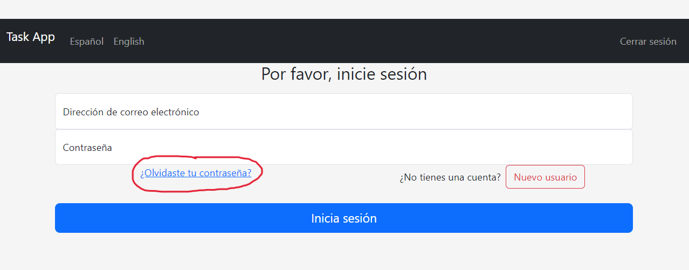
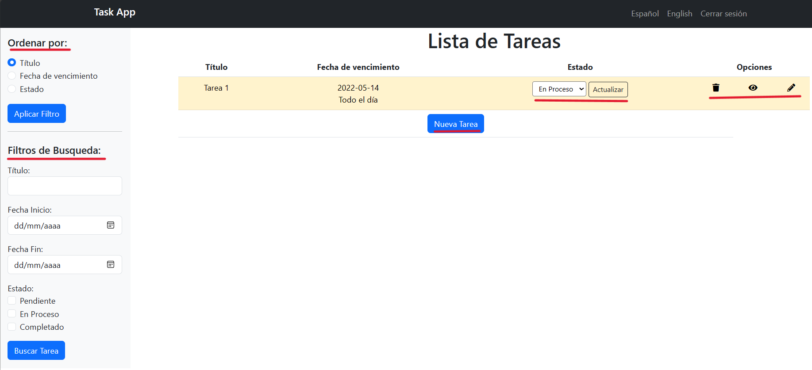

# AppTask.md

Esta pequeña aplicación permite la gestión de tareas detalladas, para ello cada usuario puede gestionar sus propias tareas.

---

## **Contenido**

<aside>
⚠️ Emplea H2 como base de datos, por lo que cualquier cambio será registrado de forma permanente.⚠️

</aside>

1. El cliente deberá iniciar sesión con un usuario, para ello puede utilizar uno predeterminado mediante el enlace de recuperar contraseña:
    
    
    
    El cliente puede crear otro usuario si así lo desea, para ello deberá tener en cuenta que:
    
    - El nombre y el email de su usuario debe ser **ÚNICO**
    

2. Una vez que se inicie sesión cada usuario será redirigido a su pagina de inicio correspondiente dónde podrá gestionar su lista de tareas.
    
    

    

---

## Funcionalidades

Desde la página de lista de tareas podemos:
- Aplicar filtros de ordenación que cambiarán la secuencia de las tareas en el listado (este filtro se guardará en una Cookie).
- Aplicar filtros de búsqueda (estos filtros se guardarán en la sesión). 
- Cambiar el estado de cada tarea (Esto hará que su color cambie dependiendo del estado)
- Eliminar una tarea
- Visualizar una tarea con todos los detalles.
- Editar una tarea.
- Agregar nuevas tareas:
    - Ningún campo puede estar vacío.
    - El título no puede contener más de 50 caracteres.
    - Si no se selecciona estado, cargara PENDIENTE por defecto.
---

## Acceso al Proyecto

Para poder ejecutar la aplicación podemos descargar el proyecto desde mi repositorio de GitHub: https://github.com/DanteSlay/TareasApp.git 

La rama master contiene el proyecto finalizado

Cabe destacar:

- El archivo pom.xml deberá ser revisado para cargar las dependencias
- Asegurese que el File Encoding emplea UTF-8

---

## Tecnologías utilizadas

- Java 17
- Spring Boot
- Thymeleaf
- Bootstrap 5.3.0
- Lombok
- Webjars Locator
- Starter Validation
- Font-Awesome
- Pequeñas funciones JavaScript, la mayoría para realizar peticiones AJAX
- H2 como BB-DD
- JPA para realizar las Query contra la BB-DD
- Spring Security
