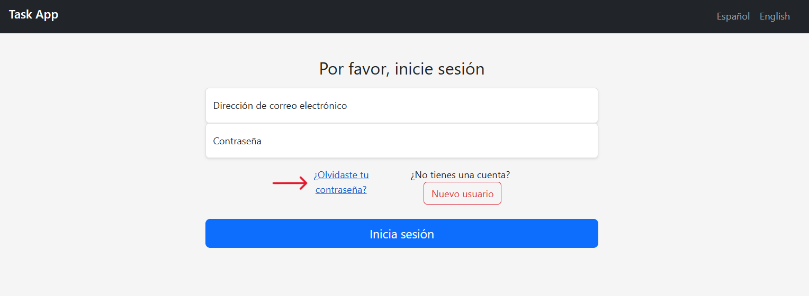

# AppTask.md

Esta pequeña aplicación permite la gestión de tareas detalladas, para ello cada usuario puede gestionar sus propias tareas.

---

## **Contenido**

<aside>
⚠️ No cuenta con una base de datos, cada vez que se inicie la aplicación tanto tareas como usuarios volverán a valores predeterminados.⚠️

</aside>

1. El cliente deberá iniciar sesión con un usuario, para ello puede utilizar uno predeterminado mediante el enlace de recuperar contraseña:
    
    
    
    El cliente puede crear otro usuario si así lo desea, para ello deberá tener en cuenta que:
    
    - El nombre y el email de su usuario debe ser **ÚNICO**
    - La contraseña debe tener entre 8 y 20 caracteres
    
2. Una vez que se inicie sesión cada usuario será redirigido a su pagina de inicio correspondiente dónde podrá gestionar su lista de tareas.
    
    
    

---

## Funcionalidades

Desde la página de lista de tareas podemos:

- Aplicar filtros de ordenación que cambiarán la secuencia de las tareas en el listado.
- Agregar nuevas tareas.
- Cambiar el estado de cada tarea (Esto hará que su color cambie dependiendo del estado)
- Eliminar una tarea
- Visualizar una tarea con todos los detalles, desde aquí también podríamos editar la tarea si asi lo deseamos:
    
    
    
    ---
    

## Acceso al Proyecto

Para poder ejecutar la aplicación podemos descargar desde mi repositorio de GitHub: https://github.com/DanteSlay/TareasApp.git 

La rama master esta actualizada, pero la rama [v2.0-Stable-Final](https://github.com/DanteSlay/TareasApp/tree/v2.0-Stable-Final)  se compone del proyecto finalizado.

Cabe destacar:

- El archivo pom.xml deberá ser revisado para cargar las dependencias
- Es posible que se tenga que revisar el File Encoding para que emplee UTF-8

---

## Tecnologías utilizadas

- Java 17
- Spring Boot
- Thymeleaf
- Bootstrap 5.3.0
- Lombok
- Webjars Locator
- Starter Validation
- Font-Awesome
- Pequeñas funciones JavaScript
